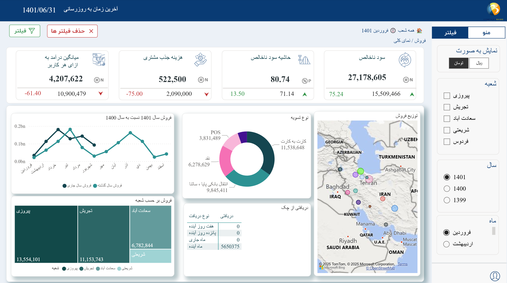

# Sales_Dashboard

A Power BI dashboard for sales performance analysis.

This report includes key metrics such as **Gross Profit**, **Gross Profit Margin**, **Customer Acquisition Cost (CAC)**, and **Average Revenue Per User (ARPU)**.

It also provides interactive filtering and visual trend analysis to help evaluate business performance and customer value over time.

